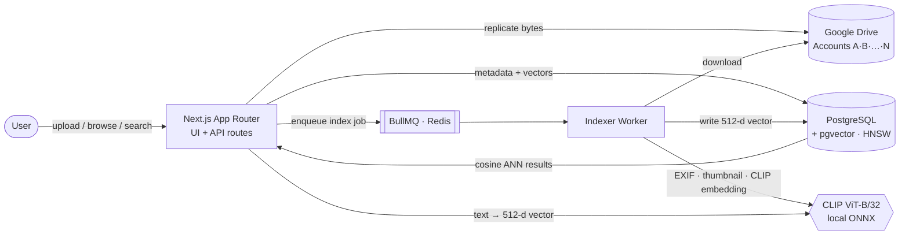
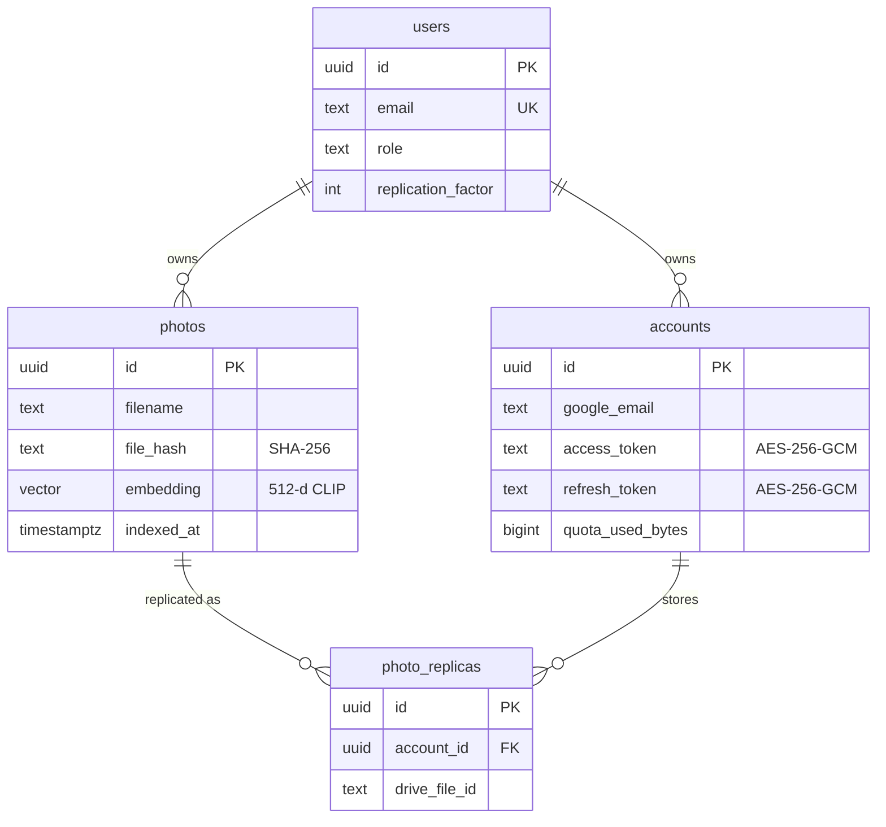

<div align="center">

# 📸 Photo Orchestrator

### Turn free Google Drive accounts into one unlimited, AI‑searchable photo cloud.

Photo Orchestrator pools storage across **multiple Google Drive accounts**, **replicates** every photo for durability, and makes your whole library searchable by **meaning** — not filenames — using a **local CLIP model** and PostgreSQL **`pgvector`**. Self‑hosted, privacy‑first, zero AI API costs.

<br/>

[](https://github.com/RuchitPahadia/Drive_Orchestrator/actions/workflows/ci.yml)


<p align="center">
  <a href="#-features"><b>Features</b></a> ·
  <a href="#-architecture"><b>Architecture</b></a> ·
  <a href="#-quick-start"><b>Quick Start</b></a> ·
  <a href="#-api-reference"><b>API</b></a> ·
  <a href="#-security--privacy"><b>Security</b></a> ·
  <a href="#-roadmap"><b>Roadmap</b></a>
</p>

</div>

---

> [!NOTE]
> **The problem:** a single free Google Drive account gives you 15 GB. **The idea:** connect several, and Photo Orchestrator treats them as *one* capacity‑pooled, auto‑replicated store — then layers semantic search on top so you can find *"sunset on a beach"* without ever tagging a thing.

## ✨ Features

| | |
|---|---|
| 🗄️ **Multi‑Account Storage Pooling** | Connect many Google Drive accounts; a capacity‑aware router picks targets by live free space and pools them into one logical store. |
| 🛡️ **Configurable Replication** | Every photo is copied across *N* distinct accounts (1–10) so a lost or deleted account never means lost photos. |
| 🧠 **Local AI Semantic Search** | Query by concept — *"dog on grass"*, *"birthday cake"* — via CLIP ViT‑B/32 running **100% locally** in ONNX. No API keys, no cloud cost, full privacy. |
| 🔎 **Visual "Find Similar"** | Nearest‑neighbor lookup from any photo using pgvector cosine distance over an HNSW index. |
| 🔐 **Encrypted at Rest** | Google OAuth tokens are sealed with **AES‑256‑GCM** (unique IV + auth tag) before they touch the database. |
| ⚡ **Resilient Background Indexing** | EXIF + thumbnail + embedding run via a BullMQ/Redis queue, with a serverless‑safe inline fallback when Redis is absent. |
| 🧹 **SHA‑256 Deduplication** | Identical uploads are detected by content hash and skipped instantly — no wasted quota. |
| 👥 **Multi‑Tenant Auth + RBAC** | NextAuth v5 (Google OAuth), per‑user data isolation, and `admin`/`user` roles enforced at the edge. |

<details>
<summary><b>🔒 Security hardening built in</b> (click to expand)</summary>

<br/>

- **CSRF‑protected account linking** — the Drive OAuth flow uses a signed, httpOnly `state` token verified in constant time.
- **Content‑validated uploads** — files are checked by magic bytes, not the client‑supplied MIME type, before storage or indexing.
- **Per‑user rate limiting** — expensive search and upload endpoints are throttled per user.
- **Parameterized SQL everywhere** — no string‑interpolated queries; least‑privilege Google scope (`drive.file`).
- **`dev-login` is dev‑only** — the one‑click test login is registered solely when `NODE_ENV !== 'production'`.

</details>

## 🏗️ Architecture


```mermaid
flowchart LR
    U([User]) -->|upload / browse / search| APP[Next.js App Router<br/>UI + API routes]

    APP -->|replicate bytes| GD[(Google Drive<br/>Accounts A·B·…·N)]
    APP -->|metadata + vectors| PG[(PostgreSQL<br/>+ pgvector · HNSW)]
    APP -->|enqueue index job| Q[[BullMQ · Redis]]

    Q --> W[Indexer Worker]
    W -->|download| GD
    W -->|EXIF · thumbnail · CLIP embedding| CLIP{{CLIP ViT-B/32<br/>local ONNX}}
    W -->|write 512-d vector| PG

    APP -->|text → 512-d vector| CLIP
    PG -->|cosine ANN results| APP
```

**How it fits together**

- **Storage router** ranks connected Drive accounts by free space and writes *N* replicas per the user's replication factor.
- **Indexer** (BullMQ worker, or inline `after()` fallback) downloads each new photo, extracts EXIF, builds a thumbnail, and computes a normalized 512‑d CLIP embedding.
- **Search** encodes the query text with the same CLIP model and runs a pgvector cosine‑distance **HNSW** ANN query — typically sub‑millisecond over thousands of photos.

<details>
<summary><b>🔍 Semantic search pipeline</b></summary>

<br/>

1. User enters natural language in `/browse` (e.g. *"golden hour mountains"*).
2. `GET /api/photos/search?q=…` encodes the text into a 512‑d normalized vector via the local CLIP text encoder.
3. PostgreSQL runs an HNSW approximate‑nearest‑neighbor query using cosine distance (`<=>`), scoped to the user and tuned via `hnsw.ef_search`.
4. Results render in the gallery with similarity badges and replica‑health indicators.

</details>

## 🧰 Tech Stack

| Layer | Technology |
|---|---|
| **Framework** | Next.js 16 (App Router, Turbopack) · React 19 · TypeScript (strict) |
| **Auth** | NextAuth v5 — Google OAuth + role-based access control |
| **Database** | PostgreSQL + `pgvector` (HNSW cosine index), raw parameterized SQL |
| **Object storage** | Google Drive (`googleapis`), N-way replication |
| **AI** | CLIP ViT-B/32 via `@huggingface/transformers` (ONNX, local, 512-d) |
| **Queue** | BullMQ + Redis (`ioredis`), inline `after()` fallback |
| **Imaging** | `sharp` (thumbnails) · `exifr` (EXIF/GPS) · SHA-256 dedup |
| **Testing / CI** | Vitest · ESLint · GitHub Actions (typecheck + lint + tests) |
| **Deploy** | Docker (web + worker) · docker-compose · Vercel-aware config |

## 🗃️ Data Model


```mermaid
erDiagram
    users ||--o{ accounts : owns
    users ||--o{ photos : owns
    photos ||--o{ photo_replicas : "replicated as"
    accounts ||--o{ photo_replicas : stores

    users {
        uuid id PK
        text email UK
        text role
        int replication_factor
    }
    accounts {
        uuid id PK
        text google_email
        text access_token "AES-256-GCM"
        text refresh_token "AES-256-GCM"
        bigint quota_used_bytes
    }
    photos {
        uuid id PK
        text filename
        text file_hash "SHA-256"
        vector embedding "512-d CLIP"
        timestamptz indexed_at
    }
    photo_replicas {
        uuid id PK
        uuid account_id FK
        text drive_file_id
    }
```

## 🚀 Quick Start

**Prerequisites:** Node.js 20+ (22 recommended) · PostgreSQL 15+ with `pgvector` (e.g. [Supabase](https://supabase.com)) · optional Redis · a Google Cloud OAuth client with the **Drive API** enabled.

```bash
# 1. Install
npm install

# 2. Configure — copy the template and fill in real values
cp .env.example .env.local

# 3. Create the schema (pgvector + tables + HNSW index)
psql "$DATABASE_URL" -f db/schema.sql

# 4. Run the app  →  http://localhost:3000
npm run dev

# 5. (optional) Run the background indexer in a second terminal
npm run worker
```

<details>
<summary><b>⚙️ Environment variables</b></summary>

<br/>

See [`.env.example`](.env.example) for the full, commented list. Key values:

| Variable | Purpose |
|---|---|
| `DATABASE_URL` | PostgreSQL + pgvector connection string |
| `DATABASE_CA_CERT` | *(optional)* CA cert (path or PEM) to enable verified DB TLS |
| `AUTH_SECRET` | NextAuth session/JWT signing secret |
| `GOOGLE_CLIENT_ID` / `GOOGLE_CLIENT_SECRET` / `GOOGLE_REDIRECT_URI` | Google OAuth (login + Drive linking) |
| `TOKEN_ENCRYPTION_KEY` | Secret for AES-256-GCM token encryption |
| `REDIS_URL` | *(optional)* BullMQ queue; falls back to inline indexing |
| `LOG_LEVEL` | *(optional)* `debug` \| `info` \| `warn` \| `error` |

Register **both** redirect URIs in Google Cloud: `/api/auth/callback/google` (login) and `/api/accounts/callback` (Drive linking).

> [!TIP]
> Generate secrets with: `node -e "console.log(require('crypto').randomBytes(32).toString('hex'))"`

</details>

## 📜 Scripts

| Command | Description |
|---|---|
| `npm run dev` | Start the dev server on `http://localhost:3000` |
| `npm run build` / `npm run start` | Production build / serve |
| `npm run worker` | Run the BullMQ background indexer |
| `npm run sync-worker` | Scan connected Drives and ingest new photos |
| `npm test` / `npm run test:watch` | Run the Vitest suite |
| `npm run lint` | ESLint |

## 📡 API Reference

| Method & Route | Description |
|---|---|
| `GET /api/auth/[...nextauth]` | NextAuth sign-in / session / sign-out |
| `GET /api/accounts` · `DELETE /api/accounts?id=` | List / disconnect connected Drive accounts |
| `GET /api/accounts/connect` · `GET /api/accounts/callback` | OAuth link flow (CSRF `state`-protected) |
| `POST /api/accounts/sync` | Discover & ingest existing photos from Drive |
| `GET /api/photos` | Paginated browse with date / account / camera filters |
| `POST /api/photos/upload` | Deduplicated, replicated, content-validated upload |
| `GET /api/photos/search?q=&limit=` | Natural-language semantic search (CLIP → pgvector) |
| `GET /api/photos/similar?photoId=&limit=` | Visually similar photos for a given image |
| `POST /api/admin/actions` | Admin-only: quota refresh, re-index, delete *(role `admin`)* |
| `GET /api/users/settings` · `PATCH` | Read / update replication factor |

## 🧪 Testing

```bash
npm test
```

Vitest covers the security- and correctness-critical pure logic: AES-256-GCM token
encryption (round-trip + tamper), magic-byte image validation, the rate limiter, and
query-parameter parsing — **23 tests**, run in CI alongside `tsc --noEmit` and ESLint.

## 🛡️ Security & Privacy

- **Least-privilege scope** — requests only `drive.file`; it can touch only files it creates, never your existing Drive.
- **Encrypted tokens** — OAuth refresh tokens are AES-256-GCM encrypted before storage.
- **100% local AI** — embeddings and search run on your own CPU/GPU via ONNX; no photo or query ever leaves for a third-party AI API.
- **Hardened surface** — CSRF-protected linking, magic-byte upload validation, per-user rate limits, generic error responses, and parameterized SQL throughout.

> [!IMPORTANT]
> This is self-hosted software: rotate your secrets, keep `.env.local` out of version control (it already is), and set `DATABASE_CA_CERT` to enable verified database TLS in production.

## 🗺️ Roadmap

**Shipped** — scaffold → DB & pgvector → OAuth & crypto → storage router → background indexer →
search & browse API → gallery UI → CLIP semantic search → real auth & RBAC → configurable
replication & dedup → Drive library sync → production polish, Docker & CI.

**Next up** *(see [`IMPROVEMENT_SUGGESTIONS.md`](IMPROVEMENT_SUGGESTIONS.md))* — distributed
(Redis-backed) rate limiting, batched sync/re-index jobs, hybrid semantic + keyword search,
object-storage thumbnails, structured error tracking, and promoting NextAuth off beta.

## 🤝 Contributing

Contributions are welcome!

1. Fork and create a branch (`git checkout -b feature/your-idea`).
2. Make your change — keep it typed and tested (`npm run lint && npm test`).
3. Ensure the build is clean (`npm run build`).
4. Open a pull request describing the change and how you verified it.

CI runs typecheck, lint, and tests on every PR to `main`.

## 📄 License

Intended for release under the **MIT License**. A `LICENSE` file is not yet committed —
add one before distributing, or update this section to match your chosen license.

<div align="center">
<br/>

**Built with Next.js · PostgreSQL + pgvector · local CLIP.**
If this project is useful to you, consider leaving a ⭐.

</div>


