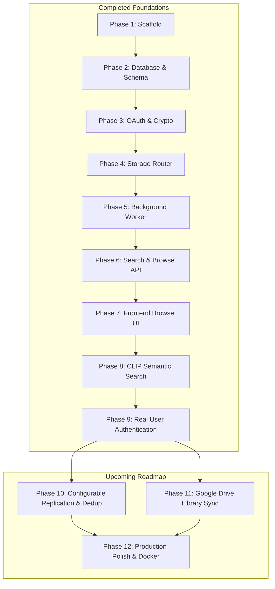

# Photo Orchestrator — Action Steps & Roadmap

This file tracks all completed operational actions, development sessions, and the standardized roadmap for upcoming phases.

---

## 📊 Master Phase Tracker

| Phase | Description | Key Deliverables | Status |
|:---:|---|---|:---:|
| **Phase 1** | Project Scaffold | Next.js 16 + TypeScript + Tailwind CSS | ✅ Done |
| **Phase 2** | Database Schema & Client | PostgreSQL + pgvector connection pool & 4 relational tables | ✅ Done |
| **Phase 3** | OAuth Connect & Token Storage | Google OAuth 2.0 (`drive.file`) + AES-256-GCM token encryption | ✅ Done |
| **Phase 4** | Storage Router & Multi-Account Upload | Primary + Secondary replica allocation across accounts | ✅ Done |
| **Phase 5** | Background Indexer Worker | BullMQ + Redis worker, Sharp thumbnails, Exifr EXIF extraction | ✅ Done |
| **Phase 6** | Search & Browse API | Structured filters (date, camera, account) & pagination | ✅ Done |
| **Phase 7** | Frontend Browse UI | Responsive photo grid, metadata lightbox, filter controls | ✅ Done |
| **Admin** | Admin Panel & Health Monitor | System stats, quota monitoring, pool health actions | ✅ Done |
| **Phase 8** | Semantic Image Search (CLIP + pgvector) | 512-d CLIP ONNX embeddings, HNSW index, text search, similar photos | ✅ Done |
| **Phase 9** | Real User Authentication | NextAuth.js v5 / Google provider, session middleware, route protection | ✅ Done |
| **Phase 10** | Configurable Replication & Dedup | Custom replica factors, SHA-256 deduplication, storage controls | 📋 Planned |
| **Phase 11** | Google Drive Library Sync | Existing Drive image scanning, automatic import, recurring sync worker | 📋 Planned |
| **Phase 12** | Production Readiness & Polish | BullMQ retry policies, skeleton loaders, Docker & CI/CD | 📋 Planned |

---

## 📜 Detailed Session History

### 📅 Session: 2026-08-14
* **Step 1: Rebuilt Database Schema after Supabase Restart**: Recreated `users`, `accounts`, `photos`, and `photo_replicas` tables with pgvector extension enabled.
* **Step 2: Fixed Default Next.js Landing Page Routing**: Replaced template landing page with server-side redirect to `/dashboard`.
* **Step 3: Created Documentation for Context & Steps Tracking**: Initialized [`context.md`](file:///C:/Users/toruc/OneDrive/Desktop/Projects/Photo_Orchestrator/context.md) and [`steps.md`](file:///C:/Users/toruc/OneDrive/Desktop/Projects/Photo_Orchestrator/steps.md).

### 📅 Session: 2026-09-14
* **Step 4: Fixed Critical OAuth Scope**: Migrated scope in [`lib/google-oauth.ts`](file:///C:/Users/toruc/OneDrive/Desktop/Projects/Photo_Orchestrator/lib/google-oauth.ts) from `drive.readonly` → `drive.file` to enable write permissions.
* **Step 5: Live Database Reconnect & HNSW Vector Index Migration**:
  - Unpaused Supabase PostgreSQL instance and re-authenticated connected test accounts.
  - Replaced legacy `ivfflat` index with production `hnsw` index (`m=16, ef_construction=64`) on `photos.embedding`.
  - Updated [`db/schema.sql`](file:///C:/Users/toruc/OneDrive/Desktop/Projects/Photo_Orchestrator/db/schema.sql).
* **Step 6: Interactive CLIP Model Notebook**: Authored [`notebooks/clip_semantic_search_walkthrough.ipynb`](file:///C:/Users/toruc/OneDrive/Desktop/Projects/Photo_Orchestrator/notebooks/clip_semantic_search_walkthrough.ipynb) explaining multimodal embeddings, cosine similarity geometry, and pgvector HNSW search.
* **Step 7: Local GPU Virtual Environment Setup**: Configured local `.venv` with PyTorch `2.6.0+cu124` for NVIDIA CUDA exploration.

### 📅 Session: 2026-09-15
* **Step 8: Google Colab GPU Optimization & Upfront Imports**:
  - Updated [`notebooks/clip_semantic_search_walkthrough.ipynb`](file:///C:/Users/toruc/OneDrive/Desktop/Projects/Photo_Orchestrator/notebooks/clip_semantic_search_walkthrough.ipynb) with "Open in Colab" badge.
  - Reorganized all module imports into an upfront initialization cell.
  - Implemented symmetric contrastive loss (`clip_contrastive_loss`) with GPU tensors and mixed-precision FP16 training (`GradScaler`).
  - Added Google Drive model export and live Supabase pgvector testing.
* **Step 9: Phase 8 Web Application Implementation**:
  - Created [`lib/embeddings.ts`](file:///C:/Users/toruc/OneDrive/Desktop/Projects/Photo_Orchestrator/lib/embeddings.ts) with singleton `@huggingface/transformers` runtime for `Xenova/clip-vit-base-patch32` (512 dimensions).
  - Updated [`lib/indexer.ts`](file:///C:/Users/toruc/OneDrive/Desktop/Projects/Photo_Orchestrator/lib/indexer.ts) to compute embeddings from 300×300 JPEG thumbnail buffers and persist to `photos.embedding`.
  - Created `GET /api/photos/search` for natural language semantic search.
  - Created `GET /api/photos/similar` for visual nearest-neighbor recommendations.
  - Updated [`app/browse/page.tsx`](file:///C:/Users/toruc/OneDrive/Desktop/Projects/Photo_Orchestrator/app/browse/page.tsx) with semantic search bar, match score badges, and lightbox "Find Similar" action.
  - Created [`scripts/backfill-embeddings.ts`](file:///C:/Users/toruc/OneDrive/Desktop/Projects/Photo_Orchestrator/scripts/backfill-embeddings.ts) utility.
* **Step 10: Dependency Deduplication & Type Safety**:
  - Resolved `TS2322` in `lib/embeddings.ts` by casting `imageBuffer` to `BlobPart`.
  - Unified native library dependency on `sharp@0.34.5` across Next.js and `@huggingface/transformers`, eliminating Windows libvips DLL conflicts.
  - Validated TypeScript clean compilation (`npx tsc --noEmit` exited 0).
* **Step 11: End-to-End Smoke Test**:
  - Created and executed [`scripts/test-phase8.ts`](file:///C:/Users/toruc/OneDrive/Desktop/Projects/Photo_Orchestrator/scripts/test-phase8.ts).
  - Verified 512-dim unit-normalized vector generation and pgvector cosine distance calculations on live Supabase instance.
* **Step 12: Documentation & Knowledge Graph Upgrades**:
  - Fully expanded [`README.md`](file:///C:/Users/toruc/OneDrive/Desktop/Projects/Photo_Orchestrator/README.md) with architecture diagrams, schema details, setup guide, and API reference.
  - Kept AST knowledge graph synchronized via `graphify update .`.
  - Pushed commits `ae054c7`, `62d667e`, and `7be5b19` to GitHub repository (`origin/main`).

### 📅 Session: 2026-09-16
* **Step 13: Implemented Phase 9 Real User Authentication (NextAuth.js v5)**:
  - Confirmed completion of Phase 8 and committed final documentation deliverables.
  - Installed `next-auth@5.0.0-beta.32` verified for Next.js 16 and React 19 compatibility.
  - Executed database migration adding `name`, `avatar_url`, and `role TEXT DEFAULT 'user' NOT NULL` to the `users` table, and synchronized [`db/schema.sql`](file:///C:/Users/toruc/OneDrive/Desktop/Projects/Photo_Orchestrator/db/schema.sql).
  - Configured generated `AUTH_SECRET` in `.env.local` for session token signing.
  - Created [`types/next-auth.d.ts`](file:///C:/Users/toruc/OneDrive/Desktop/Projects/Photo_Orchestrator/types/next-auth.d.ts) for strict TypeScript session types (`id`, `role`).
  - Created [`auth.ts`](file:///C:/Users/toruc/OneDrive/Desktop/Projects/Photo_Orchestrator/auth.ts) with Google OAuth provider and PostgreSQL user syncing/upserting callbacks.
  - Created [`app/api/auth/[...nextauth]/route.ts`](file:///C:/Users/toruc/OneDrive/Desktop/Projects/Photo_Orchestrator/app/api/auth/[...nextauth]/route.ts) dynamic API handler.
  - Implemented [`middleware.ts`](file:///C:/Users/toruc/OneDrive/Desktop/Projects/Photo_Orchestrator/middleware.ts) route guard protecting `/dashboard`, `/browse`, `/admin`, and API endpoints, redirecting unauthenticated users to `/login`.
  - Built dedicated [`app/login/page.tsx`](file:///C:/Users/toruc/OneDrive/Desktop/Projects/Photo_Orchestrator/app/login/page.tsx) with "Continue with Google", error banners, and feature cards.
  - Audited and eliminated all hardcoded `testuser@example.com` references across routes (`/api/accounts`, `/api/accounts/callback`, `/api/accounts/connect`, `/api/photos`, `/api/photos/upload`, `/api/photos/search`, `/api/photos/similar`, and `/dashboard`).
  - Enforced role-based admin access on [`app/admin/page.tsx`](file:///C:/Users/toruc/OneDrive/Desktop/Projects/Photo_Orchestrator/app/admin/page.tsx) and `/api/admin/actions`.
  - Added user profile display, initials fallback, and server-action Sign Out button to navbar.
  - Verified clean TypeScript compilation with zero errors (`npx tsc --noEmit`).

---

## 🛠️ Stabilization & Pre-Phase Status

All pre-phase prerequisites have been satisfied:

- [x] **S1: Account Re-authentication**: Both Google accounts refreshed with `drive.file` scope.
- [x] **S2: HNSW Vector Index Migration**: Production HNSW index created and verified on Supabase.
- [x] **S3: Security Hardening**: Sensitive credentials (`client_secret_*.json`, `.env.local`) gitignored.
- [x] **S4: End-to-End Verification**: Metadata extraction, thumbnail pipeline, embeddings, and pgvector cosine similarity verified.

---

## ✅ Phase 8 — Semantic Image Search (CLIP + pgvector) [COMPLETED]

**Goal**: Enable natural-language search across photos ("sunset on a beach", "family dinner") and visual similarity recommendations using local CLIP embeddings and PostgreSQL `pgvector`.

### Implementation Summary

| Component | File / Path | Key Technical Decisions |
|---|---|---|
| **Inference Engine** | [`lib/embeddings.ts`](file:///C:/Users/toruc/OneDrive/Desktop/Projects/Photo_Orchestrator/lib/embeddings.ts) | `@huggingface/transformers` singleton loading `Xenova/clip-vit-base-patch32` (quantized 8-bit ONNX, ~80 MB). Exposes `generateTextEmbedding`, `generateImageEmbedding`, and `formatVectorForPostgres`. Zero cloud API costs. |
| **Indexing Pipeline** | [`lib/indexer.ts`](file:///C:/Users/toruc/OneDrive/Desktop/Projects/Photo_Orchestrator/lib/indexer.ts) | Embeddings generated directly from 300×300 JPEG thumbnail buffer (~15 KB) rather than 20 MB original photo buffer. Drops RAM footprint from ~50 MB to <100 KB with identical embedding representation. |
| **Search API** | [`app/api/photos/search/route.ts`](file:///C:/Users/toruc/OneDrive/Desktop/Projects/Photo_Orchestrator/app/api/photos/search/route.ts) | Converts query text into 512-d vector; queries pgvector with `1 - (embedding <=> $1::vector) AS similarity`; ranks results with configurable limit and threshold. |
| **Visual Similarity API** | [`app/api/photos/similar/route.ts`](file:///C:/Users/toruc/OneDrive/Desktop/Projects/Photo_Orchestrator/app/api/photos/similar/route.ts) | Fetches source photo's vector and performs nearest-neighbor search against remaining photos. |
| **Frontend UI** | [`app/browse/page.tsx`](file:///C:/Users/toruc/OneDrive/Desktop/Projects/Photo_Orchestrator/app/browse/page.tsx) | Clean AI search bar with instantaneous filter clearing, visual similarity percentage tags on cards, and 1-click "Find Similar" action in the lightbox. |
| **Backfill Tool** | [`scripts/backfill-embeddings.ts`](file:///C:/Users/toruc/OneDrive/Desktop/Projects/Photo_Orchestrator/scripts/backfill-embeddings.ts) | CLI utility to backfill embeddings for existing database photos missing vectors. |
| **Colab Walkthrough** | [`notebooks/clip_semantic_search_walkthrough.ipynb`](file:///C:/Users/toruc/OneDrive/Desktop/Projects/Photo_Orchestrator/notebooks/clip_semantic_search_walkthrough.ipynb) | Complete educational and fine-tuning notebook configured for Colab Tesla T4 / A100 GPUs. |

---

## 🚀 Upcoming Phases (Standardized Specification)

---

## ✅ Phase 9 — Real User Authentication [COMPLETED]

**Goal**: Replace the hardcoded test user (`testuser@example.com`) with a multi-tenant authentication system.

#### Specification & Steps
- [x] **Step 9.1 — NextAuth.js Integration**:
  - Install `next-auth@beta` (v5 App Router compatible).
  - Create `auth.ts` at project root with Google OAuth provider.
  - Create route handler `app/api/auth/[...nextauth]/route.ts`.
- [x] **Step 9.2 — Database User Mapping**:
  - Ensure authenticated Google account maps or auto-creates a record in `users (id, email, name, avatar_url, role)`.
  - Link multiple connected Google Drive accounts to the authenticated user ID.
- [x] **Step 9.3 — Route Protection Middleware**:
  - Create `middleware.ts` to guard `/dashboard`, `/browse`, `/admin`, and `/api/*` endpoints.
  - Redirect unauthenticated sessions to `/login`.
- [x] **Step 9.4 — Dedicated Login Page**:
  - Build `app/login/page.tsx` styled with Tailwind CSS, featuring "Sign in with Google".
- [x] **Step 9.5 — Audit & Replace Hardcoded User IDs**:
  - Audit all files referencing `testuser@example.com` (`app/api/accounts/callback/route.ts`, `app/api/photos/upload/route.ts`, `app/api/photos/route.ts`, `app/dashboard/page.tsx`, etc.).
  - Replace with `const session = await auth(); const userId = session.user.id;`.
- [x] **Step 9.6 — Role-Based Admin Access**:
  - Add `role TEXT DEFAULT 'user'` to `users` table.
  - Restrict `/admin` page and `/api/admin/*` actions to `role = 'admin'`.

---

### 📦 Phase 10 — Configurable Replication & Deduplication
**Goal**: Provide granular control over storage redundancy and eliminate duplicate photo storage.

#### Specification & Steps
- [ ] **Step 10.1 — Replication Factor Configuration**:
  - Add `replication_factor INTEGER DEFAULT 2` column to `users`.
  - Update [`lib/storage-router.ts`](file:///C:/Users/toruc/OneDrive/Desktop/Projects/Photo_Orchestrator/lib/storage-router.ts) to select top N accounts ranked by available storage ratio.
- [ ] **Step 10.2 — Storage Settings Interface**:
  - Add settings view inside `/dashboard` to adjust replication factor (1 to N accounts).
  - Render dynamic storage capacity estimates at each replication tier.
- [ ] **Step 10.3 — SHA-256 Deduplication**:
  - Add `file_hash TEXT` column to `photos` with unique constraint per user.
  - Compute SHA-256 checksum during upload; if matching hash exists, link replica records and skip redundant upload.

---

### 🔄 Phase 11 — Google Drive Library Sync (Import Existing Photos)
**Goal**: Ingest and index existing photos already present in connected Google Drive accounts.

#### Specification & Steps
- [ ] **Step 11.1 — Drive Scanner Service**:
  - Create `lib/drive-scanner.ts` using `drive.files.list` with `mimeType contains 'image/'`.
  - Implement cursor pagination via `nextPageToken`.
- [ ] **Step 11.2 — Sync API Endpoint**:
  - Create `POST /api/accounts/sync` taking `accountId`.
  - Compare discovered `driveFileId` with `photo_replicas` to identify new images.
  - Batch create `photos` and `photo_replicas` entries and push indexing jobs to BullMQ.
- [ ] **Step 11.3 — Sync Dashboard UI**:
  - Add "Scan & Sync Account" action to account cards on `/dashboard`.
  - Display progress indicators and counters for newly discovered photos.
- [ ] **Step 11.4 — Automated Background Sync**:
  - Configure recurring BullMQ cron job to scan connected accounts periodically (e.g. every 12 hours).

---

### ⚡ Phase 12 — Polish & Production Readiness
**Goal**: Harden operational reliability, UX polish, and containerized deployment.

#### Specification & Steps
- [ ] **Step 12.1 — Queue Resilience & Dead-Letter Handling**:
  - Configure exponential backoff and retry limits (`attempts: 3, delay: 5000ms`) on BullMQ queue.
  - Implement dead-letter queue (DLQ) for permanently failed indexing jobs.
- [ ] **Step 12.2 — Loading States & Error Boundaries**:
  - Add skeleton loaders for `/dashboard` and `/browse`.
  - Implement React error boundaries with retry mechanisms.
- [ ] **Step 12.3 — Navigation & Layout Modernization**:
  - Implement persistent navigation layout with active route indicators and mobile support.
- [ ] **Step 12.4 — Performance Optimizations**:
  - Integrate `next/image` with remote patterns for optimized image rendering.
  - Implement virtualized grid rendering for large galleries (1,000+ items).
- [ ] **Step 12.5 — Containerization & CI/CD**:
  - Create multi-stage `Dockerfile` for Next.js web service.
  - Create `Dockerfile` for standalone BullMQ worker.
  - Provide `docker-compose.yml` bundling Web, Worker, and Redis.
  - Add GitHub Actions CI workflow for linting, type-checking, and tests.

---

## 🗺️ Roadmap & Dependency Graph

**Recommended Execution Sequence**:
`Phase 10 (Replication & Dedup)` ➔ `Phase 11 (Drive Sync)` ➔ `Phase 12 (Production Polish)`
